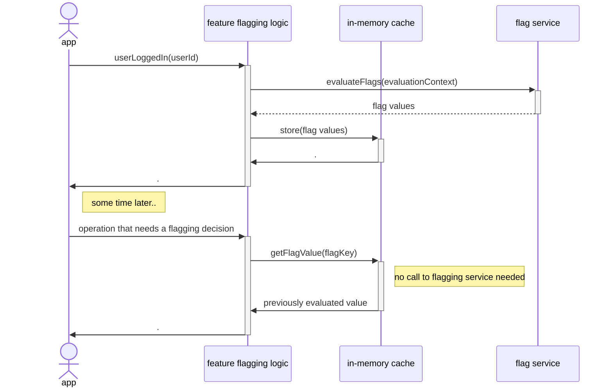

While OpenFeature initially focused on support for server-side feature flagging, we know that a lot of feature-flagging (likely the majority) happens on the client - mobile apps and frontend web apps. As such, we're currently finalizing [a proposal](https://github.com/open-feature/spec/issues/167) which extends the OpenFeature spec to support client-side use cases. 

In this post I'll summarize those changes, but to understand them in context we'll first talk about what makes client-side feature flagging different before diving into how that will impact the OpenFeature APIs.

## Context is King: why client-side flagging is different

### Static evaluation context

The biggest difference between the client- and server-side feature flagging is the relative frequency of evaluation context changes within those two paradigms. In the typical server-side scenario - a service responding to http requests - the context for a feature flagging decision changes with every request. Every new request is coming from a new user, and a lot of the evaluation context which affects a feature flagging decision is based on the user making the request.

In contrast, with a client-side app all feature flagging decisions are made in the context of the same user - the user interacting with the client-side app - and so the evaluation context is relatively static. There are cases where evaluation context will change within a client-side app - when a user logs in, for example - but by and large with client-side code we can treat feature flag evaluation context as something that is fixed (while still providing mechanisms to update it).

### Flag evaluation is slow

With server-side flags, we can assume that evaluating a feature flag is a relatively fast operation. In some scenarios the flagging rules can be evaluated in-process, and if not then flag evaluation is typically a quick service call - akin to making a DB query or calling a redis cache.

This situation is quite different with client-side flags. It's typically not possible to evaluate a flagging decision locally. Local evaluation would require the full feature flagging ruleset to be exposed to the client, something many organizations are not comfortable with. Additionally, flag evaluation may require additional context that's simply not available on the client at the time of evalution. 

This means that a client-side flag evalution requires a backend call. Unfortunately we should also anticipate the latency for such a call to be slow, particularly if our users are behind a spotty internet connection. In fact, with a native mobile app we have to handle a fully disconnected client.

### Pre-evaluation

So client-side flag evaluation is slow, but we've also seen that the inputs into that flag evaluation - the evaluation context - are fairly static for client-side apps, and that means the *results* of flag evaluation are fairly static too.

How do we handle an expensive operation with fairly static results? We add caching! And that's what most client-side feature flagging frameworks do. Specifically, they do an optimistic pre-evaluation of all the feature flagging decisions that might be needed and then cache those decisions. Then whenever client-side code needs to make a flagging decision the framework simply returns the pre-evaluated result from its local cache. 



Put another way, we separate flag [**evaluation**](/docs/specification/glossary#evaluating-flag-values) - passing an evaluation context through a set of rules in order to determine a flagging decision - from flag [**resolution**](/docs/specification/glossary#resolving-flag-values) - getting the flagging decision for a specific feature flag.

## Client-side support in OpenFeature

With OpenFeature we have been thinking about how to support these key differences between client-side and server-side feature flagging. We think about these differences as two paradigms: dynamic context (for server-side flags) and static context (for client-side flags). 

OpenFeature's current Evaluation API supports the dynamic paradigm quite nicely, but to support the static paradigm (and thus client-side flagging) we need to add a second flavor of the Evaluation API. 

### Server-side evaluation today
Let's compare and contrast. A typical server-side flagging decision using OpenFeature's current SDK might look something like this:
``` java
@GetMapping("/hello")
public String getSalutation() {
    final Client client = openFeatureAPI.getClient();
    final evalContext:EvaluationContext = evalContextForCurrentRequest();

    if (client.getBooleanValue("use-formal-salutation", false, evalContext)) {
      return "Good day to you!";
    }else{
      return "Hey, what's up?";
    }
} 
```
You can see that we're passing evaluation context every time we need to make a flagging decision.

### Client-side evaluation tomorrow
With the currently proposed OpenFeature changes, a client-side flagging decision would look more like this:

``` java
public string generateSalutation(){
  if (client.getBooleanValue("use-formal-salutation", false)) {
    return "Good day to you!";
  }else{
    return "Hey, what's up?";
  }
}
```

You can see we are no longer passing any evaluation context when requesting a flagging decisions. 

But our flagging framework needs to get flag evaluation context from somewhere. So rather than passing the context as part of each flagging decision, the app provides a new evaluation context to OpenFeature whenever a user logs in or out (as part of this app's hypothetical `onAuthenticated(...)` handler): 

``` java
// called whenever a user logs in (or out)
public void onAuthenticated(userId:String){
  OpenFeatureAPI api = OpenFeatureAPI.getInstance();
  api.setEvaluationContext(new MutableContext().add("targettingKey", userId));
}
```

This call to update the evaluation context can prompt the configured flagging provider to update any cached feature flag values using the new evaluation context. The provider will be notified that the evaluation context has changed via a new `onContextSet` handler which is being added to the OpenFeature provider interface:

``` java
class MyFlaggingProvider implements Provider {
  // triggered when `setEvaluationContext` is called
  onContextSet(EvaluationContext oldContext, EvaluationContext newContext): void {
    // here the provider can re-evaluate flags using the next evaluation context, updating any
    // previously cached flag values
  }
  //...
}
```

### Javascript niceties
In order to align the OpenFeature API with most existing feature flagging providers, and to play nicely with frontend frameworks, the static context flavor of the JavaScript Evaluation API will be a synchronous call:

``` javascript
  function Salutation(){
    const useFormalSalutation = client.getBooleanValue("use-formal-salutation", false);
    if(formalSalutation){
      return <blink>Good day!</blink>;
    }else{
      return <blink>What's up!</blink>;
    }
  }
```

contrast this with how a server-side flagging decision would be implemented, using the dynamic context flavor of the Evaluation API:

``` javascript
const client = OpenFeature.getClient();

app.get("/hello", async (req, res) => {
  const evalContext = evaluationContextForRequest(req);
  const formalSalutation = await client.getBooleanValue("use-formal-salutation", false, evalContext);
  if (formalSalutation) {
    res.send("Good day!");
  } else {
    res.send("What's up!");
  }
});
```

This dynamic context flavor of `getBooleanValue(...)` must accept a different evaluation context every time it's called. This means the OpenFeature API can't be synchronous, since some feature flagging implementations will need to use asynchronous mechanisms such as networks calls in order to perform a new flag evaluation. However in the client-side example the evaluation context has been provided ahead of time and we can assume that the flagging decision can be made synchronously by pulling from a local cache.

### Non-authoritative results
This synchronous API also lines up better with the the way rendering works in client-side web frameworks like React and Vue - via a synchronous call. However, with a synchronous API we have a potential for a race condition. What happens if our rendering logic asks for a flagging decision before a pre-evaluation operation has completed? We can't block, and so will have to return some sort of non-authoritative decision - a default value, or a previously evaluated value, or perhaps a null value. This is the price we pay for using a synchronous API. In that scenario where we have provided our rendering logic with a non-authoritative decision, we also need some way to trigger a re-render once an authoritative value is available. OpenFeature will provide a mechanism for that in the form of Provider Events. Here's how you might use provider events as part of a React hook:

``` javascript
  client.addHandler(ProviderEvents.FlagValuesChanged, ()=>{
    // this would trigger a re-render
    setUseFormalSalutation(
      client.getBooleanValue("use-formal-salutation", false)
    )
  });
```

### A multi-paradigm SDK

To recap, OpenFeature is planning to support client-side feature flagging by introducing the concept of two flagging paradigms: dynamic context (for server-side flagging) and static context (for client-side flagging). The OpenFeature APIs will have two slightly different flavors, depending upon which paradigm they support.

One question that arises from this is that of distribution - how will we distribute these two flavors of API for languages such as JavaScript and Java which support both paradigms. Our intention in those situations is to distribute two distinct packages. For example with JavaScript we will likely have a `@openfeature/js-node-sdk` package and a `@openfeature/js-browser-sdk` package. We are opting for this approach rather that distributing a single "universal", multi-paradigm package contain both APIs because we think this will be less confusing for developers getting started with OpenFeature. Under the covers the two packages will likely share a lot of common code.

If a feature flagging provider wants to provide support for both paradigms they will need to provide two distinct implementations of the [Provider API](/docs/specification/sections/providers). These implementations could be shipped as part of a "universal" multi-paradigm, or as separate packages. 
